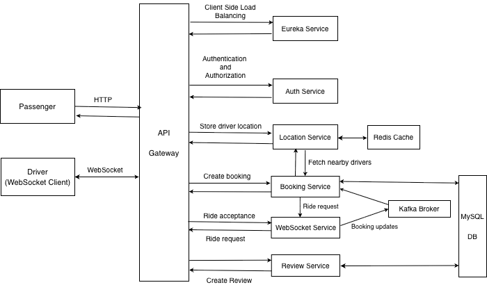

# 🚀 Uber Microservices Platform

**Enterprise-Grade Microservices Architecture for Ride-Hailing System**

A production-ready, scalable microservices platform demonstrating advanced backend engineering patterns including API Gateway authentication delegation, event-driven architecture, real-time communication, and AWS cloud deployment.

---

## 🏗️ High-Level Design

### **System Architecture Overview**

This platform implements a sophisticated microservices architecture with the following key components:

- **API Gateway** - Single entry point with authentication delegation
- **Service Discovery** - Dynamic service resolution via Eureka
- **Authentication Service** - Centralized JWT validation and user management
- **Event-Driven Communication** - Asynchronous processing through Kafka
- **Real-Time Updates** - WebSocket for instant driver notifications
- **Geospatial Queries** - Redis-powered location-based services
- **Database Persistence** - MySQL with automated migrations

### **Core Microservices**

1. **API Gateway** - Request routing and authentication delegation
2. **Service Discovery** - Eureka server for service registry
3. **Auth Service** - JWT creation, validation, and user management
4. **Entity Service** - Database migrations and shared data models
5. **Booking Service** - Ride booking management with Kafka integration
6. **Location Service** - Driver location tracking with Redis geospatial queries
7. **Socket Service** - Real-time WebSocket communication and event publishing
8. **Review Service** - Post-ride rating and review system

---

## 🎯 Key Features & Capabilities

### **🔐 Enterprise Authentication & Security**
- ✅ **JWT-based Authentication** with Auth Service as single source of truth
- ✅ **Role-Based Access Control** for drivers and passengers with secure inter-service communication

### **📱 Production-Ready Business Features**
- ✅ **User Registration & Authentication** - Driver and passenger onboarding with automated validation
- ✅ **Real-Time Location Tracking** - Redis-powered geospatial queries for nearby driver search
- ✅ **Intelligent Ride Booking** - Request creation with driver matching and status synchronization
- ✅ **Live Driver Notifications** - WebSocket integration for instant ride request broadcasts
- ✅ **Event-Driven Ride Flow** - Kafka-based asynchronous processing for ride acceptance
- ✅ **Review & Rating System** - Complete post-ride feedback mechanism

### **⚡ Advanced Real-Time & Event Architecture**
- ✅ **WebSocket Communication** - Instant driver notifications with STOMP protocol
- ✅ **Event-Driven Architecture** - Kafka for guaranteed asynchronous message delivery
- ✅ **Geospatial Capabilities** - Redis GEORADIUS for sub-second nearby driver queries
- ✅ **Service Discovery & Load Balancing** - Dynamic service resolution with Eureka

### **🌐 Cloud-Native Enterprise Patterns**
- ✅ **Scalable AWS Deployment** - Full infrastructure with VPC, RDS, ElastiCache, MSK
- ✅ **Database Migration Strategy** - Flyway-based schema versioning and automated migrations
- ✅ **Automated Service Management** - Health checks, monitoring, and environment configuration
- ✅ **End-to-End Observability** - CloudWatch integration with comprehensive logging

---

## 🛠️ Technology Stack

### **Backend Framework**
- **Java 17** - Modern LTS with enhanced performance
- **Spring Boot** - Production-grade application framework
- **Spring Cloud Gateway** - API Gateway with advanced routing
- **Spring Security** - Authentication and authorization
- **Spring Data JPA** - Data persistence and ORM
- **Spring WebSocket** - Real-time bidirectional communication

### **Data & Messaging**
- **MySQL** - Primary relational database
- **Redis** - In-memory caching and geospatial operations
- **Apache Kafka** - Event streaming and asynchronous messaging
- **Flyway** - Database migration and versioning

### **Service Architecture**
- **Netflix Eureka** - Service registry and discovery
- **Spring Cloud LoadBalancer** - Client-side load balancing
- **WebSocket (STOMP)** - Real-time messaging protocol
- **Gradle** - Build automation and dependency management

### **Cloud Infrastructure (AWS)**
- **Amazon EC2** - Scalable compute instances
- **Amazon VPC** - Secure network isolation
- **Amazon RDS** - Managed database service
- **Amazon ElastiCache** - Managed in-memory cache
- **Amazon MSK** - Managed streaming platform
- **Application Load Balancer** - High-availability traffic distribution
- **CloudWatch** - Comprehensive monitoring and logging

---

## 📚 Demo
To be updated
---